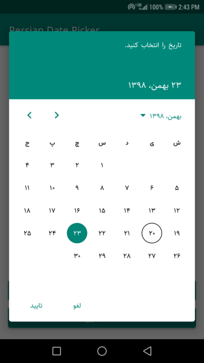
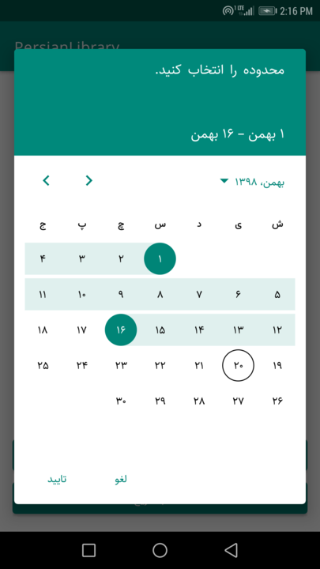
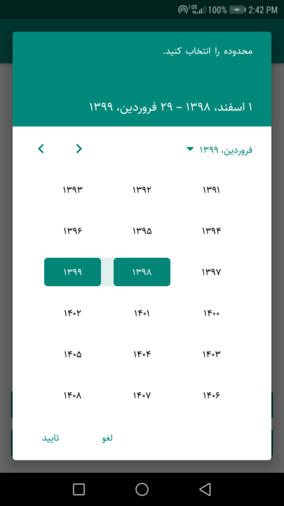
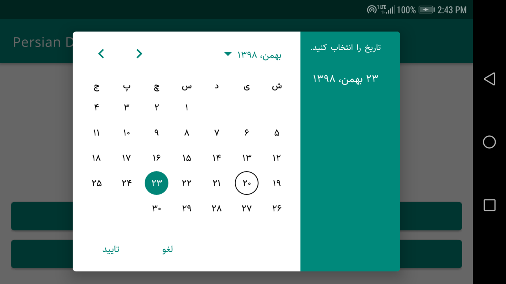
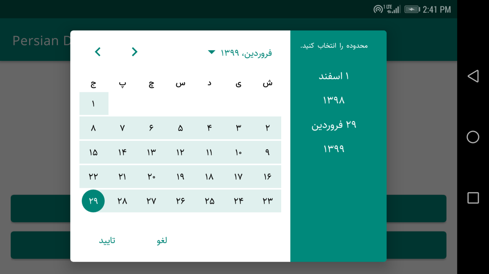

# PersianDatePicker [  ](https://bintray.com/xdeveloper/PersianDatePicker/com.xdev.arch.persiancalendar.datepicker/_latestVersion)
Shamsi/Jalali date picker with material design ([Google Material Components Date Picker](https://github.com/material-components/material-components-android))

<p>
&emsp;
&emsp;

</p>

<p>
&emsp;

</p>

This library is based on [Googles Material Date Picker](https://github.com/material-components/material-components-android).
I reimplemented everything in Kotlin.

## How To Use
Minimum SDK: 21

Add this to your gradle file
```groovy
    implementation 'com.xdev.arch.persiancalendar.datepicker:datepicker:0.3.2'
```

## Customization
The picker can be customized via the [MaterialDatePicker.Builder](https://github.com/axdeveloper/PersianDatePicker/blob/master/persiancalendar/src/main/java/com/xdev/arch/persiancalendar/datepicker/MaterialDatePicker.kt)
and the
[CalendarConstraints.Builder](https://github.com/axdeveloper/PersianDatePicker/blob/master/persiancalendar/src/main/java/com/xdev/arch/persiancalendar/datepicker/CalendarConstraints.kt).
These classes allow you to

-  Select the mode: single date or range of dates.
-  Select the bounds: bounds can be restricted to any contiguous set of months. Defaults Farvardin, 1388. to Esfand, 1409.
-  Select valid days: valid days can restrict selections to weekdays only. Defaults to all days as valid.
-  Set a title.
-  Set the month to which the picker opens (defaults to the current month if within the bounds otherwise the earliest month within the bounds).
-  Set a default selection (defaults to no selection).

## Examples
First you can define a [CalendarConstraints](https://github.com/axdeveloper/PersianDatePicker/blob/master/persiancalendar/src/main/java/com/xdev/arch/persiancalendar/datepicker/CalendarConstraints.kt) to limit dates
You can use [PersianCalendar](https://github.com/axdeveloper/PersianDatePicker/blob/master/persiancalendar/src/main/java/com/xdev/arch/persiancalendar/datepicker/calendar/PersianCalendar.kt) class to set a Persian/Shamsi date or a java.util.Calendar instance
```kotlin
        val calendar = PersianCalendar()
        calendar.setPersian(1340, Month.FARVARDIN, 1)

        val start = calendar.timeInMillis
        
        calendar.setPersian(1409, Month.ESFAND, 29)
        val end = calendar.timeInMillis
        
        val openAt = PersianCalendar.getToday().timeInMillis
        
        val constraints = CalendarConstraints.Builder()
            .setStart(start)
            .setEnd(end)
            .setOpenAt(openAt)
            .setValidator(DateValidatorPointForward.from(start)).build()
```

Then we should create [MaterialDatePicker](https://github.com/axdeveloper/PersianDatePicker/blob/master/persiancalendar/src/main/java/com/xdev/arch/persiancalendar/datepicker/MaterialDatePicker.kt)

### Single Date Picker
```kotlin
        val datePicker = MaterialDatePicker.Builder
            .datePicker()
            .setTitleText("تاریخ را انتخاب کنید.")
            .setCalendarConstraints(constraints).build()
```
### Range Date Picker
```kotlin
        val rangePicker = MaterialDatePicker.Builder
            .dateRangePicker()
            .setTitleText("محدوده را انتخاب کنید.")
            .setCalendarConstraints(constraints).build()
```
And finaly call show()
```kotlin
            datepicker.show(supportFragmentManager, "aTag")
            rangePicker.show(supportFragmentManager, "aTag")
```
## Listeners
  There are 4 listeners: 
-   OnPositiveButtonClickListener
-   OnNegetiveButtonClickListener
-   OnCancelListener
-   OnDismissListener

## Styling and Attributes
Refer to [Sample's styles.xml](https://github.com/axdeveloper/PersianDatePicker/blob/master/app/src/main/res/values/styles.xml)

## Contributors
Rahman Mohammadi [@axdeveloper](https://github.com/axdeveloper)

## License
2020 Rahman Mohammadi ([@axdeveloper](https://github.com/axdeveloper)). See the `LICENSE` file.
